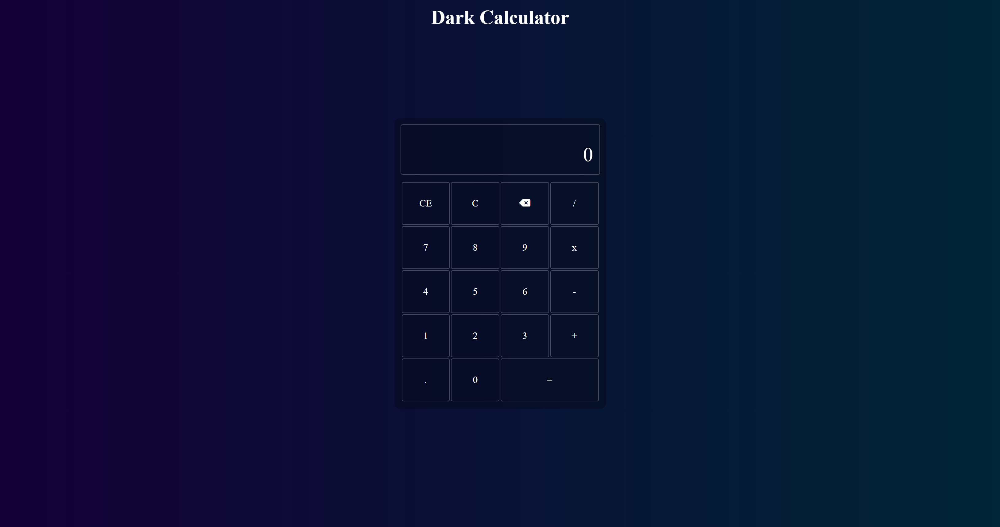

# Responsive Dark calculator

> This is a project of a calculator built based on a simpler version of the windows calculator. With this calculator you can do addition, subtraction, multiplication and division.

🔗 [Click here to access](https://caiomiyaji.github.io/calculator/)

## 🔧 Used technologies:

- HTML
- CSS
- Javascript

## 😎 Contact me:

c.hideki@hotmail.com